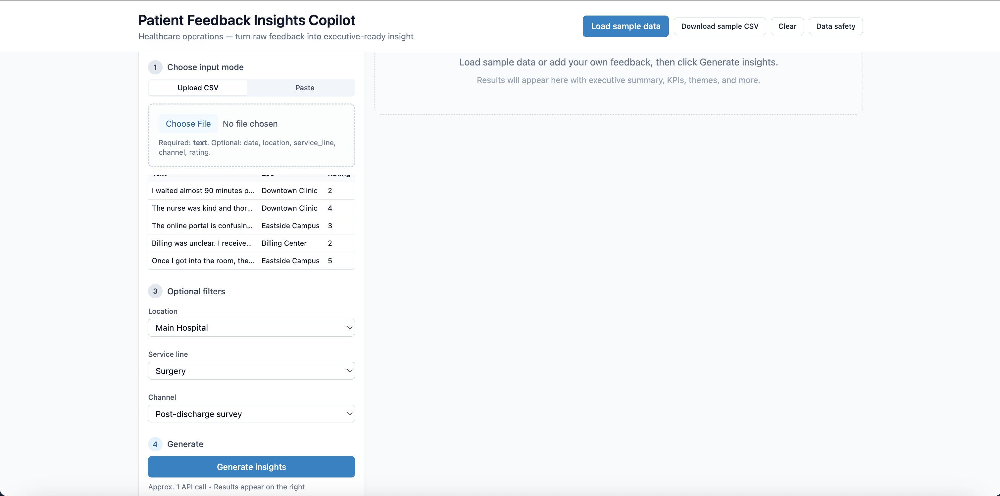
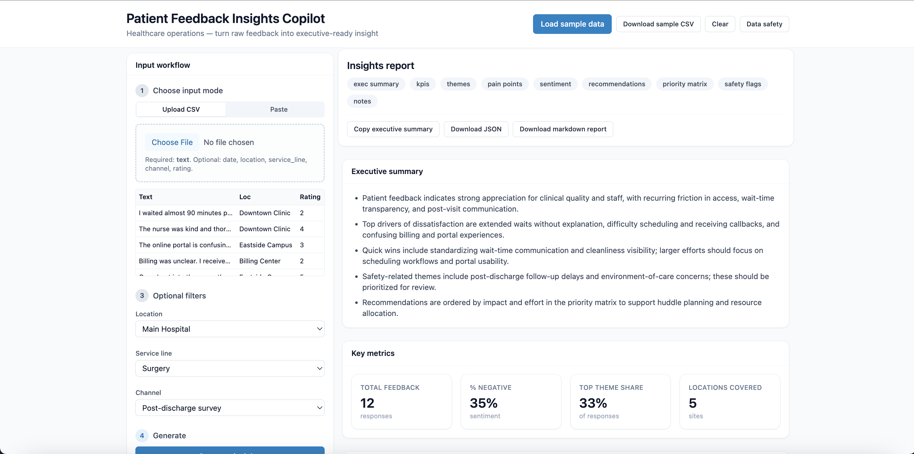

# Patient Feedback Insights Copilot

A healthcare-focused web app that turns raw patient feedback (CSV or pasted text) into executive-ready insights: themes, pain points, sentiment, recommendations, priority matrix, and safety flags.

---

## Problem

Healthcare organizations collect large volumes of patient feedback from surveys, portals, and call centers. Turning that free text into actionable insight for leadership and operations is time-consuming and inconsistent. This tool automates the first mile: structure the feedback, surface themes and pain points, score sentiment, and suggest prioritized recommendations with evidence.

---

## Who it’s for

- **Clinic and hospital operations** — quick readouts for huddles and leadership.
- **Patient experience and quality teams** — theme and sentiment trends without manual tagging.
- **Product and demo use** — recruiters and interviewers who want to show a full-stack, healthcare-aware product.

---

## Features

- **Dual input**: Upload a CSV (required `text` column; optional `date`, `location`, `service_line`, `channel`, `rating`) or paste one feedback item per line.
- **Stepper workflow**: Choose mode → provide data → optional filters (location, service line, channel) → generate.
- **Executive-style output**:
  - Executive summary (3–5 bullet points, leadership tone).
  - KPI strip: total feedback, % negative, top theme share, locations covered.
  - Top 8 themes and top 8 pain points, each with count and one evidence quote.
  - Sentiment donut (positive / neutral / negative).
  - Exactly 6 recommendations (title, rationale, owner, timeframe, impact, effort).
  - 2×2 priority matrix (impact vs effort) with recommendations placed in quadrants.
  - Safety & quality flags (up to 5) with category, severity badge, and quote.
  - Notes and caveats (sample size, channel bias, what to verify).
- **Exports**: Copy executive summary, download full JSON, download one-page markdown report.
- **Demo-friendly**: “Load sample data” (12 rows), “Download sample CSV”, “Clear” to reset.
- **PHI guardrail**: Client-side check for phone numbers, emails, and name-like patterns; submit is blocked until the user confirms data is de-identified.
- **Mock mode**: If `OPENAI_API_KEY` is not set, the app returns realistic mocked healthcare insights so the UI and workflow are fully usable.

---

## Screenshots

<!-- Add a screenshot of the main two-column layout here -->


<!-- Add a screenshot of the results panel with KPIs and themes -->


*(Placeholder: add `docs/screenshot-main.png` and `docs/screenshot-results.png` from your local run.)*

---

## How it works

1. User adds feedback via CSV upload or paste; optional filters narrow by location / service line / channel.
2. Optional client-side PHI check warns if phone, email, or name-like patterns are detected; user must confirm before submit.
3. Frontend POSTs `{ items, settings }` to `/api/analyze`. Request is validated with Zod (items 1–2000, settings for model, audience, output length, and toggles).
4. **Backend**:
   - Trims and filters empty `text`; returns 400 if none left.
   - If `OPENAI_API_KEY` is missing: returns a deterministic mock response (themes/pain points with evidence quotes from input, KPIs, 6 recommendations, priority matrix, safety flags, notes and caveats).
   - If key is set: sends feedback (chunked by character limit) to OpenAI with a healthcare-specific, JSON-only prompt; parses the response into the structured schema and returns it.
5. Results are rendered in a right-hand panel with sticky header, quick-nav chips to jump to sections, and export actions.

---

## Tech stack

- **Frontend**: Next.js 14 (App Router), React 18, TypeScript, Tailwind CSS, Recharts (sentiment donut).
- **Backend**: Next.js Route Handler `POST /api/analyze`, Zod validation, OpenAI API (optional).
- **Data**: PapaParse (CSV), no database.

---

## Limitations

- No authentication or persistence; single-session, in-memory only.
- PHI detection is heuristic (regex + simple patterns), not a substitute for formal de-identification.
- Large inputs are truncated by character limit before sending to the model; mock uses full item set for theme/quote selection.
- Demo tool for learning and portfolio use; not intended for production PHI.

---

## How to run

```bash
# Install dependencies
npm install

# Optional: set OpenAI key for live analysis (omit for mock-only)
export OPENAI_API_KEY=sk-...

# Development
npm run dev
```

Open [http://localhost:3000](http://localhost:3000).

---

## Demo steps (recruiter-ready)

1. Open the app; click **Load sample data** to load 12 patient feedback rows.
2. Click **Generate insights**; wait a few seconds (or instant if mock).
3. Scroll the right panel: Executive summary → KPIs → Themes (with quotes) → Pain points → Sentiment donut → Recommendations → Priority matrix → Safety flags → Notes and caveats.
4. Use **Copy executive summary**, **Download JSON**, and **Download markdown report** to show exports.
5. Click **Data safety** to show the PHI/anonymization notice; optionally paste text with a phone number and show the PHI confirmation dialog before submit.
6. Use **Download sample CSV** then **Upload CSV** to show CSV flow; use **Clear** to reset.

---

## Resume bullets

- **Built a full-stack Patient Feedback Insights Copilot** (Next.js 14, TypeScript, OpenAI) that ingests patient feedback via CSV or paste, validates and chunks payloads, and returns executive-style reports (KPIs, themes with evidence quotes, sentiment, prioritized recommendations, and safety flags) with optional mock mode when no API key is set.
- **Designed and implemented a healthcare-focused analysis API** with Zod-validated request bodies, character-based chunking for scale, and deterministic mock responses that compute theme counts and evidence quotes from real input for demo and testing without external services.
- **Shipped a recruiter-ready demo UI** with a two-column stepper workflow, sticky results panel and section navigation, PHI detection guardrail with user confirmation, and one-click exports (clipboard, JSON, markdown report) plus sample data and CSV download for instant walkthroughs.
